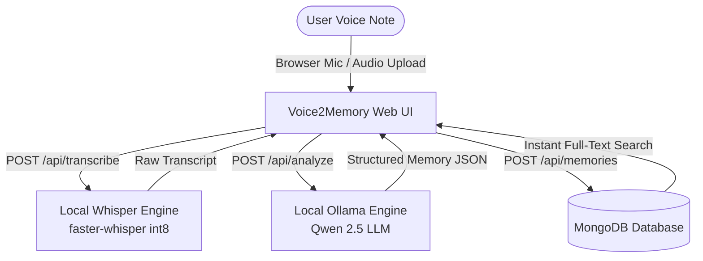

# Voice2Memory 🎙️ ➔ 🧠

> **Turn your voice into memories you can actually use.**  
> Built for the **Hacktoberfest 2026 DEV Challenge #1: "Build for a Friend"**.

---

## 💡 The Problem

My friend frequently records voice notes on the go to remember tasks, startup ideas, meeting action items, dates, and spontaneous thoughts. 

Later, whenever they need to find a specific task or follow up on a promise, they are forced to **replay the entire audio recording** from start to finish. This leads to wasted time, buried action items, missed deadlines, and lost context.

---

## ✨ The Solution

**Voice2Memory** converts spoken voice notes into **structured, searchable personal memories** using 100% local, open-source AI:

1. **Speech-to-Text**: Converts voice recordings or uploaded audio into high-accuracy transcripts using local **Whisper** (`faster-whisper` with CTranslate2 backend).
2. **AI Structuring**: An open-weight LLM running via **Ollama** (`Qwen2.5`) analyzes the transcript to extract:
   - 📌 **Concise Title**
   - 📝 **Executive Summary**
   - ✅ **Actionable Tasks** (checklist format)
   - 📅 **Important Dates & Deadlines**
   - 👤 **People Mentioned**
   - 🏷️ **Topics & Tags**
3. **Local Database**: Stores structured memories in **MongoDB** for instantaneous search, filtering, and retrieval.

---

## 🏗️ Architecture



---

## 🔒 Why Open-Source AI?

- **100% Privacy & Ownership**: Spoken voice notes often contain sensitive personal thoughts, client names, project secrets, and private schedules. Using local models ensures personal voice recordings never leave your device.
- **Zero API Costs**: No recurring per-minute audio billing or per-token LLM costs.
- **Offline Capable & Fast**: Inference runs directly on your CPU/GPU without cloud network roundtrips.
- **Model Flexibility**: Easily swap Whisper models (`tiny`, `base`, `small`) or Ollama LLMs (`qwen2.5`, `gemma2`, `llama3.2`) based on your hardware.

---

## 🛠️ Tech Stack

- **Frontend**: Next.js 16 (App Router), React 19, TypeScript, Tailwind CSS 4
- **Speech Engine**: OpenAI Whisper (`faster-whisper` 1.2.1 / CTranslate2 with `int8` quantization & PyAV)
- **Local LLM**: Ollama (`qwen2.5:1.5b` open-weight model)
- **Database**: MongoDB & Mongoose
- **Icons & Styling**: Lucide React & Tailwind CSS

---

## 📋 Prerequisites

Before running the project locally, make sure you have:

1. **Node.js**: v18+ (tested on Node v20/v22)
2. **Python**: 3.10+ with `faster-whisper`
   ```bash
   pip install faster-whisper
   ```
3. **Ollama**: [Download Ollama](https://ollama.com/download)
4. **MongoDB**: Local MongoDB instance or MongoDB Atlas URI

---

## 🚀 Quick Setup & Installation

### 1. Clone the Repository
```bash
git clone https://github.com/your-username/voice2memory.git
cd voice2memory
```

### 2. Install Dependencies
```bash
npm install
```

### 3. Setup Ollama Model
Start Ollama and pull the recommended open-source extraction model:
```bash
ollama serve
ollama pull qwen2.5:1.5b
```

### 4. Environment Variables
Copy `.env.example` to `.env.local`:
```bash
cp .env.example .env.local
```

Configured defaults:
```env
MONGODB_URI=mongodb://127.0.0.1:27017/voice2memory
OLLAMA_BASE_URL=http://127.0.0.1:11434
OLLAMA_MODEL=qwen2.5:1.5b
```

### 5. Run the Development Server
```bash
npm run dev
```

Open [http://localhost:3000](http://localhost:3000) in your browser.

---

## 📁 Project Structure

```
voice2memory/
├── scripts/
│   └── transcribe.py         # Standalone faster-whisper transcription script
├── src/
│   ├── app/
│   │   ├── api/
│   │   │   ├── analyze/      # POST /api/analyze (Ollama memory extraction)
│   │   │   ├── memories/     # GET & POST /api/memories (List, search, save)
│   │   │   │   └── [id]/     # GET & DELETE /api/memories/[id]
│   │   │   └── transcribe/   # POST /api/transcribe (Whisper audio processing)
│   │   ├── memories/         # Searchable memories gallery & detail pages
│   │   ├── record/           # Microphone recording & audio upload studio
│   │   ├── globals.css       # Design tokens and custom utilities
│   │   ├── layout.tsx        # Global layout with Header & Footer
│   │   └── page.tsx          # Landing page with Recent Memories
│   ├── components/
│   │   ├── home/             # Hero and RecentMemories components
│   │   ├── layout/           # Header and Footer components
│   │   ├── memory/           # MemoryCard component
│   │   ├── recording/        # VoiceRecorder, UploadAudio, StructuredMemoryResult
│   │   └── ui/               # LoadingSpinner, icons
│   ├── lib/
│   │   ├── db.ts             # Cached MongoDB Mongoose singleton
│   │   ├── ollama.ts         # Ollama client, JSON recovery, & prompt engine
│   │   └── mockData.ts       # Sample memory seeds and helpers
│   ├── models/
│   │   └── Memory.ts         # Mongoose schema with text search indexes
│   └── types/
│       └── index.ts          # TypeScript type definitions
├── .env.example              # Environment variables template
├── package.json
└── README.md
```

---

## 🧪 Testing

Run the full verification suite:
```bash
# TypeScript verification
npm run build

# ESLint audit
npm run lint
```

---

## 🏆 Hacktoberfest 2026 Submission

- **Event**: Hacktoberfest 2026 DEV Weekend Challenge #1
- **Theme**: "Build for a Friend"
- **Author**: Built with pair-programming assistance from Antigravity Agent.

---

## 🔮 Future Improvements

- [ ] Export memories to Markdown / Notion / Obsidian.
- [ ] Voice note tags and custom folder collections.
- [ ] Calendar integration (.ics export for extracted dates).
- [ ] Multi-lingual speech transcription with auto-translation.
