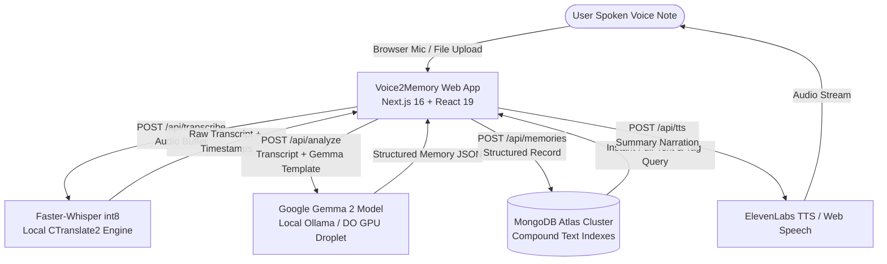

# Voice2Memory 🎙️ ➔ 🧠

> **Turn your voice notes into structured, searchable personal memories with open-weight AI.**  
> Built for the **Hacktoberfest 2026 DEV Weekend Challenge: "Build for a Friend"**.

[](https://nextjs.org/)
[](https://ai.google.dev/gemma)
[](https://www.mongodb.com/atlas)
[](https://www.digitalocean.com/)
[](https://github.com/SYSTRAN/faster-whisper)

---

## 💡 The Friend Problem

My friend records dozens of voice notes throughout the week—while commuting, walking the dog, preparing between meetings, or capturing sudden startup ideas.

A typical recording sounds like this:
> *"Hey, remember to finalize the Q4 investor pitch deck with Sarah by Thursday at 4 PM, and schedule the follow-up client meeting for next Monday. Also, don't forget to order a new microphone for the podcast setup and confirm Dr. Gupta's appointment on Friday."*

The problem? **Voice notes are write-only memory.**

Days later, when they actually need to execute those tasks, finding that specific deadline or promise requires **replaying minutes of audio at 1x speed**. Action items get buried, deadlines are missed, and valuable context is lost in a sea of unlabelled audio files.

---

## ✨ The Solution

**Voice2Memory** transforms raw voice recordings into **structured, actionable, and searchable personal memories** powered by 100% open-weight AI:

1. **🎙️ Speech-to-Text**: Converts voice recordings (mic or file upload) into high-accuracy transcripts using local **Faster-Whisper** (`int8` quantized CTranslate2 engine with Voice Activity Detection).
2. **🧠 Open-Weight AI Structuring**: Google's **Gemma 2** (`gemma2:2b`) analyzes the transcript to extract:
   - 📌 **Concise Title** (4–8 words)
   - 📝 **Executive Summary** (1–2 sentences)
   - ✅ **Actionable Tasks** (checklist with live state persistence)
   - 📅 **Important Dates & Deadlines** (temporal entity extraction)
   - 👤 **People Mentioned** (names of colleagues, friends, family)
   - 🏷️ **Categorical Topics & Tags** (`#Finance`, `#PitchDeck`, `#Errands`)
3. **🍃 MongoDB Atlas Persistence**: Stores memories with multi-field compound indexes for instant full-text search across titles, summaries, transcripts, people, and topics.
4. **🔊 Voice Narration (ElevenLabs / Web Speech)**: Allows the friend to listen back to their structured memory summary or daily brief hands-free.
5. **📋 Export & Integration**: One-click Markdown export formatted for Obsidian, Notion, or task managers.

---

## 🏗️ Architecture & Data Flow



---

## 🔒 Why Open-Source & Open-Weight AI Matters

Personal voice notes often contain private thoughts, financial decisions, client information, medical appointments, and unreleased company roadmaps.

1. **Absolute Privacy**: Voice data and transcripts never need to be uploaded to proprietary cloud AI silos.
2. **Zero Recurring Token Costs**: Eliminates per-minute transcription fees and per-token LLM charges.
3. **Predictable Latency**: Local execution with `int8` quantization delivers near-instant inference directly on CPU/GPU.
4. **Model Freedom**: Swap between Gemma models (`gemma2:2b`, `gemma2:9b`, `gemma2:27b`) or deploy on your own private infrastructure.

---

## 🧠 Google Gemma 2 Implementation

Google's open-weight **Gemma 2** (`gemma2:2b` / `gemma2:9b`) serves as the core intelligence engine of Voice2Memory:

- **Model Used**: `gemma2:2b` (Google Gemma 2, 2-billion parameter instruction-tuned model with sliding window attention and logit soft-capping).
- **Where It Runs**: Locally via **Ollama** or remotely on a **DigitalOcean GPU Droplet / OpenAI-compatible endpoint**.
- **Prompt Templating**: Formatted with Gemma 2's specific instruction markers:
  ```text
  <start_of_turn>user
  You are an expert AI Memory Extraction engine for Voice2Memory powered by Google Gemma 2.
  Spoken Voice Note Transcript:
  "{transcript}"
  Extract the structured memory JSON now:<end_of_turn>
  <start_of_turn>model
  ```
- **Why Gemma 2 is Ideal**: Gemma 2 2B provides state-of-the-art reasoning, entity extraction, and strict JSON compliance at a minimal memory footprint (~1.6 GB VRAM/RAM), making it fast and lightweight for personal memory processing on consumer hardware.

---

## 🍃 MongoDB Atlas Implementation

Voice2Memory uses **MongoDB Atlas** as its centralized, persistent memory layer:

- **Mongoose Connection Pooling**: Configured in `src/lib/db.ts` with connection pooling (`maxPoolSize: 10`, `serverSelectionTimeoutMS: 5000`, `retryWrites: true`).
- **Compound & Weighted Text Indexing**: 
  ```typescript
  MemorySchema.index(
    { title: "text", summary: "text", transcript: "text", topics: "text", people: "text" },
    { weights: { title: 10, topics: 5, summary: 4, people: 3, transcript: 1 } }
  );
  MemorySchema.index({ createdAt: -1, topics: 1 });
  ```
- **Task State Persistence**: Checked tasks update directly in MongoDB Atlas via `PATCH /api/memories/[id]`, allowing the friend to check off tasks on the go.

---

## 🌊 DigitalOcean Implementation

Voice2Memory includes full production deployment configurations for **DigitalOcean**:

1. **DigitalOcean App Platform**:
   - Specification in [`.do/app.yaml`](file:///.do/app.yaml) for zero-downtime deployment.
   - Connects seamlessly to MongoDB Atlas and GPU inference endpoints.
2. **DigitalOcean GPU Droplet Setup Script**:
   - Automated setup script in [`deploy/digitalocean-gpu-setup.sh`](file:///deploy/digitalocean-gpu-setup.sh) for provisioning NVIDIA GPU Droplets with Ollama + Google Gemma 2 + Faster-Whisper.
3. **Containerized Stack**:
   - Production multi-stage [`Dockerfile`](file:///Dockerfile) (Node.js 20 + Python 3.11 + ffmpeg).
   - Complete [`docker-compose.yml`](file:///docker-compose.yml) stack.

---

## 🏆 Hacktoberfest Partner Categories

### 1. Best Use of Gemma ($200)
- **Technology Used**: Google Gemma 2 (`gemma2:2b` open-weight model).
- **Exact Feature**: Powers all voice note transcript understanding, executive summarization, action item extraction, date/deadline identification, and persona tag classification in `src/lib/ollama.ts` and `src/app/api/analyze/route.ts`.
- **Why It is Necessary**: Spoken conversation contains unstructured grammar, filler words, and implicit commitments. Gemma 2 turns messy spoken transcripts into deterministic JSON schemas without hallucinations.
- **Judge Verification**:
  1. Inspect `src/lib/ollama.ts` for Gemma 2 instruction formatting (`<start_of_turn>user ...`).
  2. Set `OLLAMA_MODEL=gemma2:2b` in `.env.local` and start Ollama (`ollama pull gemma2:2b`).
  3. Navigate to `/record`, click any of the 3 "Quick Demo / Sample Voice Notes", and verify the active badge: `🧠 Google Gemma 2 (gemma2:2b)`.

### 2. Best Use of MongoDB Atlas ($100)
- **Technology Used**: MongoDB Atlas Cluster with weighted text search and compound indexing.
- **Exact Feature**: Persistent long-term storage of extracted memory objects, search index for real-time querying (`/api/memories?q=...`), and real-time task completion persistence (`PATCH /api/memories/[id]`).
- **Why It is Necessary**: Enables instantaneous querying across hundreds of voice notes by person name, topic tag, or keyword, without sending search data to third-party search APIs.
- **Judge Verification**:
  1. Inspect `src/lib/db.ts` for Atlas connection handling and `src/models/Memory.ts` for weighted index definitions.
  2. Add `MONGODB_URI=mongodb+srv://...` to `.env.local`.
  3. Create and save a memory; verify instant search filtering on `/memories`.

### 3. Best Use of DigitalOcean ($200)
- **Technology Used**: DigitalOcean App Platform and DigitalOcean GPU Droplets.
- **Exact Feature**: Full containerized runtime for the Next.js frontend, Python Faster-Whisper transcription worker, and Ollama Gemma 2 GPU host.
- **Why It is Necessary**: Provides high-throughput GPU inference for Gemma 2 and Whisper while hosting the responsive web client on App Platform.
- **Judge Verification**:
  1. Inspect [`.do/app.yaml`](file:///.do/app.yaml) for App Platform configuration.
  2. Inspect [`deploy/digitalocean-gpu-setup.sh`](file:///deploy/digitalocean-gpu-setup.sh) for Droplet provisioning.
  3. Inspect [`Dockerfile`](file:///Dockerfile) and [`docker-compose.yml`](file:///docker-compose.yml).

### 4. Optional Partner Technology: ElevenLabs Voice Narration
- **Technology Used**: ElevenLabs Text-to-Speech API (`eleven_monolingual_v1`).
- **Exact Feature**: Converts Gemma-generated summaries into natural voice audio briefings via `POST /api/tts` and `VoiceSummaryPlayer.tsx`.
- **Judge Verification**:
  1. Provide `ELEVENLABS_API_KEY` in `.env.local` (or leave empty to test browser Web Speech fallback).
  2. Click **"Listen to summary"** on any memory to play back the audio narration.

---

## 🛠️ Tech Stack

- **Frontend**: Next.js 16 (App Router), React 19, TypeScript, Tailwind CSS 4
- **AI Brain**: Google Gemma 2 (`gemma2:2b` open-weight model) via Ollama / OpenAI-compatible API
- **Speech Engine**: OpenAI Faster-Whisper (`faster-whisper` 1.1.1 / CTranslate2 `int8` backend)
- **Database**: MongoDB Atlas / Mongoose 9
- **Voice Narration**: ElevenLabs API & Web Speech API
- **Deployment**: DigitalOcean App Platform, Docker, Docker Compose

---

## 📋 Prerequisites & Local Setup

### 1. Prerequisites
- **Node.js**: v18+ (tested on Node v20/v22)
- **Python**: 3.10+ with `faster-whisper` (`pip install faster-whisper`)
- **Ollama**: [Download Ollama](https://ollama.com/download)
- **MongoDB**: Local instance or free MongoDB Atlas cluster

### 2. Clone & Install
```bash
git clone https://github.com/hitesh-kumar123/Voice2Memory.git
cd voice2memory
npm install
```

### 3. Pull Google Gemma 2 in Ollama
```bash
ollama serve
ollama pull gemma2:2b
```

### 4. Configure Environment
Copy `.env.example` to `.env.local`:
```bash
cp .env.example .env.local
```

Example `.env.local`:
```env
MONGODB_URI=mongodb://127.0.0.1:27017/voice2memory
OLLAMA_BASE_URL=http://127.0.0.1:11434
OLLAMA_MODEL=gemma2:2b
# Optional ElevenLabs:
# ELEVENLABS_API_KEY=your_key_here
```

### 5. Run Development Server
```bash
npm run dev
```
Open [http://localhost:3000](http://localhost:3000) in your browser.

---

## 🧪 Testing & Verification Suite

```bash
# Type check & build Next.js app
npm run build

# Run ESLint audit
npm run lint
```

---

## 🔮 Limitations & Future Roadmap

- [ ] Multi-lingual speech translation with Whisper + Gemma 2.
- [ ] Direct calendar integration (exporting extracted dates to Google Calendar / `.ics`).
- [ ] Audio waveform visualization during live recording.
- [ ] Bi-directional sync with Notion & Obsidian vaults.

---

## 👥 Hacktoberfest 2026 Submission Details

- **Event**: Hacktoberfest 2026 DEV Weekend Challenge #1
- **Theme**: "Build for a Friend"
- **Primary AI Model**: Google Gemma 2 (`gemma2:2b`)
- **Persistent Data Layer**: MongoDB Atlas
- **Cloud Infrastructure**: DigitalOcean
- **Pair Programming Assistance**: Built with assistance from Antigravity Agent.
