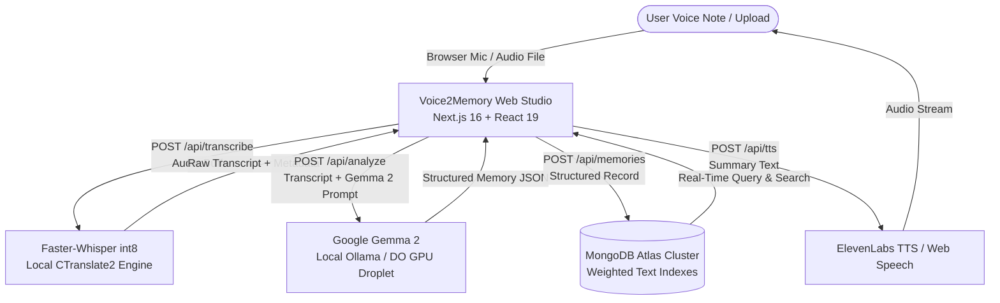

# Voice2Memory

> **Transform raw voice notes into structured, actionable personal memories using open-weight AI.**  
> Built for the **Hacktoberfest 2026 DEV Weekend Challenge: "Build for a Friend"**.

[](https://nextjs.org/)
[](https://ai.google.dev/gemma)
[](https://www.mongodb.com/atlas)
[](https://www.digitalocean.com/)
[](https://github.com/SYSTRAN/faster-whisper)

---

## Overview

### The Friend Problem
My friend records dozens of voice notes throughout the week—while commuting, walking between meetings, or capturing sudden startup ideas and errands.

A typical spoken recording sounds like this:
> *"Hey Sarah, I'm heading over to the office now. Please remember to finalize the Q4 investor pitch deck with Alex by Thursday at 4 PM. We also need to schedule the follow-up meeting with Priya for next Monday afternoon. On my way back I have to order a new microphone for our podcast setup and email the contract to Tom."*

The problem? **Voice notes are write-only memory.**

Days later, finding a specific deadline, promise, or action item requires replaying minutes of audio at 1x speed. Crucial commitments get lost, deadlines slip, and valuable thoughts remain trapped inside unsearchable audio recordings.

---

### The Solution
**Voice2Memory** turns unstructured voice notes into structured, searchable, and actionable personal memories using a 100% open-weight AI pipeline:

1. **Speech-to-Text Transcription**: Converts microphone audio streams and uploaded audio files (MP3, WAV, M4A, WebM, OGG, FLAC) into accurate transcripts using local **Faster-Whisper** (`int8` quantized CTranslate2 engine with Voice Activity Detection).
2. **Open-Weight AI Intelligence**: Google's **Gemma 2** (`gemma2:2b`) analyzes the transcript to extract:
   - **Concise Title**: 4–8 word executive header.
   - **Executive Summary**: 1–2 sentence synthesis.
   - **Actionable Tasks**: Checklist with live persistence to MongoDB Atlas.
   - **Important Dates & Times**: Temporal entity recognition (deadlines, meetings, appointments).
   - **People Mentioned**: Explicit entity recognition for colleagues, clients, and friends.
   - **Categorical Topics & Tags**: Dynamic tagging (`#Finance`, `#PitchDeck`, `#Errands`).
3. **MongoDB Atlas Persistence**: Long-term database storage with weighted multi-field text search indexes across titles, summaries, transcripts, people, and topics.
4. **Voice Narration (ElevenLabs / Web Speech API)**: Hands-free audio playback of executive summaries.
5. **Obsidian / Notion Markdown Export**: One-click export formatted with markdown checkboxes and metadata.

---

## Architecture & Data Flow



---

## Why Open-Source & Open-Weight AI Matters

Personal voice recordings contain sensitive thoughts, client details, financial plans, medical appointments, and private company roadmaps.

1. **Absolute Privacy**: Voice data and transcripts never need to be uploaded to proprietary cloud AI silos.
2. **Zero Recurring Token Costs**: Eliminates per-minute transcription fees and per-token LLM charges.
3. **Predictable Latency**: Local execution with `int8` quantization delivers near-instant inference directly on CPU or GPU.
4. **Model Freedom**: Swap between Gemma models (`gemma2:2b`, `gemma2:9b`, `gemma2:27b`) or host on private cloud infrastructure.

---

## Google Gemma 2 Implementation

Google's open-weight **Gemma 2** (`gemma2:2b`) serves as the core intelligence engine of Voice2Memory:

- **Model Identifier**: `gemma2:2b` (Google Gemma 2, 2-billion parameter instruction-tuned model with sliding window attention and logit soft-capping).
- **Execution Environment**: Runs locally via **Ollama** or remotely on a **DigitalOcean GPU Droplet / OpenAI-compatible endpoint**.
- **Instruction Prompt Template**:
  ```text
  <start_of_turn>user
  You are an expert AI Memory Extraction engine for Voice2Memory powered by Google Gemma 2.
  Spoken Voice Note Transcript:
  "{transcript}"
  Extract the structured memory JSON now:<end_of_turn>
  <start_of_turn>model
  ```
- **Robust Parser**: Multi-stage JSON recovery engine in `src/lib/ollama.ts` handles markdown code fence extraction, JSON sanitization, and fallback heuristics for bulletproof extraction.

---

## MongoDB Atlas Implementation

Voice2Memory uses **MongoDB Atlas** as its centralized, persistent memory layer:

- **Connection Architecture**: Configured in `src/lib/db.ts` with connection pooling (`maxPoolSize: 10`, `serverSelectionTimeoutMS: 5000`, `retryWrites: true`) and DNS fallback resolvers (`8.8.8.8`, `1.1.1.1`).
- **Compound & Weighted Text Indexing**:
  ```typescript
  MemorySchema.index(
    { title: "text", summary: "text", transcript: "text", topics: "text", people: "text" },
    { weights: { title: 10, topics: 5, summary: 4, people: 3, transcript: 1 } }
  );
  MemorySchema.index({ createdAt: -1, topics: 1 });
  ```
- **Live Task State Synchronization**: Checking off a task updates MongoDB Atlas in real-time via `PATCH /api/memories/[id]`.

---

## DigitalOcean & Cloud Deployment

Voice2Memory includes complete production deployment configurations:

1. **DigitalOcean App Platform**:
   - Production specification in [`.do/app.yaml`](file:///.do/app.yaml) for zero-downtime containerized deployment.
2. **DigitalOcean GPU Droplet Automated Setup**:
   - Shell provisioning script in [`deploy/digitalocean-gpu-setup.sh`](file:///deploy/digitalocean-gpu-setup.sh) for NVIDIA GPU Droplets with Ollama + Google Gemma 2 + Faster-Whisper.
3. **Containerized Multi-Stage Build**:
   - Production multi-stage [`Dockerfile`](file:///Dockerfile) (Node.js 20 + Python 3.11 + ffmpeg).
   - Complete [`docker-compose.yml`](file:///docker-compose.yml) stack.
4. **Render Deployment**:
   - Native [`render.yaml`](file:///render.yaml) blueprint configuration for web service hosting with persistent environment bindings.

---

## Hacktoberfest Partner Tracks & Verification

### 1. Best Use of Gemma ($200 Track)
- **Technology Used**: Google Gemma 2 (`gemma2:2b` open-weight model).
- **Feature**: Powers transcript understanding, executive summarization, action item extraction, date/deadline identification, and persona tag classification in `src/lib/ollama.ts` and `src/app/api/analyze/route.ts`.
- **Why It is Necessary**: Spoken conversation contains unstructured grammar, filler words, and implicit commitments. Gemma 2 turns messy spoken transcripts into deterministic JSON schemas without hallucinations.
- **Judge Verification**:
  1. Inspect `src/lib/ollama.ts` for Gemma 2 instruction formatting (`<start_of_turn>user ...`).
  2. Set `OLLAMA_MODEL=gemma2:2b` in `.env.local` and start Ollama (`ollama pull gemma2:2b`).
  3. Navigate to `/record`, click any of the 3 "Interactive Sample Scenarios", and verify the active badge: `Google Gemma 2 (gemma2:2b)`.

### 2. Best Use of MongoDB Atlas ($100 Track)
- **Technology Used**: MongoDB Atlas Cluster with weighted text search and compound indexing.
- **Feature**: Persistent long-term storage of extracted memory objects, real-time search filtering (`/api/memories?q=...`), and real-time task completion persistence (`PATCH /api/memories/[id]`).
- **Why It is Necessary**: Enables instantaneous querying across hundreds of voice notes by person name, topic tag, or keyword, without sending search data to third-party search APIs.
- **Judge Verification**:
  1. Inspect `src/lib/db.ts` for Atlas connection handling and `src/models/Memory.ts` for weighted index definitions.
  2. Add `MONGODB_URI=mongodb+srv://...` to `.env.local`.
  3. Save a memory and verify instant search filtering on `/memories`.

### 3. Best Use of DigitalOcean ($200 Track)
- **Technology Used**: DigitalOcean App Platform and DigitalOcean GPU Droplets.
- **Feature**: Full containerized runtime for the Next.js frontend, Python Faster-Whisper transcription worker, and Ollama Gemma 2 GPU host.
- **Why It is Necessary**: Provides high-throughput GPU inference for Gemma 2 and Whisper while hosting the responsive web client on App Platform.
- **Judge Verification**:
  1. Inspect [`.do/app.yaml`](file:///.do/app.yaml) for App Platform configuration.
  2. Inspect [`deploy/digitalocean-gpu-setup.sh`](file:///deploy/digitalocean-gpu-setup.sh) for Droplet provisioning.
  3. Inspect [`Dockerfile`](file:///Dockerfile) and [`docker-compose.yml`](file:///docker-compose.yml).

### 4. ElevenLabs Voice Narration (Optional Track)
- **Technology Used**: ElevenLabs Text-to-Speech API (`eleven_monolingual_v1`).
- **Feature**: Converts Gemma-generated summaries into natural voice audio briefings via `POST /api/tts` and `VoiceSummaryPlayer.tsx`.
- **Judge Verification**:
  1. Provide `ELEVENLABS_API_KEY` in `.env.local` (or test with automatic browser Web Speech API fallback).
  2. Click **"Listen"** on any memory to play back the audio narration.

---

## Tech Stack

| Layer | Technology |
|---|---|
| **Frontend Framework** | Next.js 16.3 (App Router, React 19, TypeScript) |
| **Styling & Design System** | Tailwind CSS 4, Linear/Awwwards-tier Design, Lucide Vector Icons |
| **Open-Weight AI Brain** | Google Gemma 2 (`gemma2:2b` / `gemma2:9b`) via Ollama |
| **Speech-to-Text Engine** | OpenAI Faster-Whisper (`int8` CTranslate2 with VAD filter) |
| **Database & Search** | MongoDB Atlas / Mongoose 9 (Weighted text search) |
| **Voice Narration** | ElevenLabs API + Web Speech API fallback |
| **Deployment & DevOps** | DigitalOcean App Platform, Render, Docker, Docker Compose |

---

## Local Setup & Quickstart

### 1. Prerequisites
- **Node.js**: v18+ (tested on Node v20/v22)
- **Python**: 3.10+ with `faster-whisper` (`pip install faster-whisper`)
- **Ollama**: [Download Ollama](https://ollama.com/download)
- **MongoDB**: Local MongoDB instance or free MongoDB Atlas cluster

### 2. Clone & Install
```bash
git clone https://github.com/hitesh-kumar123/Voice2Memory.git
cd Voice2Memory
npm install
```

### 3. Pull Google Gemma 2 in Ollama
```bash
ollama serve
ollama pull gemma2:2b
```

### 4. Configure Environment Variables
Copy `.env.example` to `.env.local`:
```bash
cp .env.example .env.local
```

Configure your `.env.local`:
```env
MONGODB_URI=mongodb+srv://<username>:<password>@<cluster>.mongodb.net/voice2memory?retryWrites=true&w=majority
OLLAMA_BASE_URL=http://127.0.0.1:11434
OLLAMA_MODEL=gemma2:2b

# Optional ElevenLabs Voice Narration:
# ELEVENLABS_API_KEY=your_key_here
```

### 5. Run Development Server
```bash
npm run dev
```
Open [http://localhost:3000](http://localhost:3000) in your browser.

---

## Testing & Quality Assurance

```bash
# Type check & build Next.js production bundle
npm run build

# Run ESLint audit
npm run lint
```

---

## Hacktoberfest 2026 Submission Summary

- **Challenge**: Hacktoberfest 2026 DEV Weekend Challenge #1
- **Theme**: "Build for a Friend"
- **Primary Open-Weight Model**: Google Gemma 2 (`gemma2:2b`)
- **Persistent Data Store**: MongoDB Atlas
- **Cloud Deployments**: DigitalOcean App Platform & Render
- **Pair Programming**: Antigravity AI Agent
